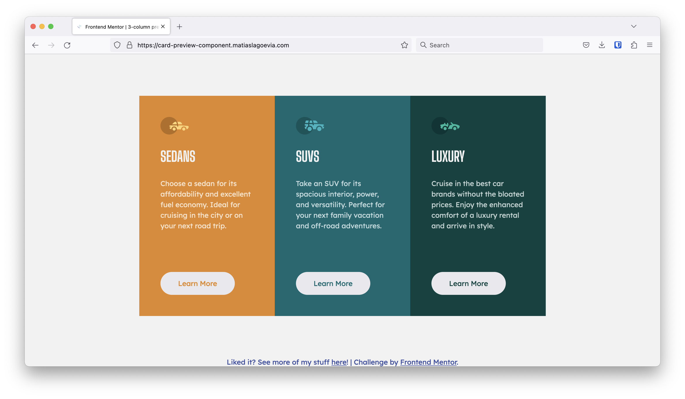

# Frontend Mentor - 3-column preview card component solution

This is a solution to the [3-column preview card component challenge on Frontend Mentor](https://www.frontendmentor.io/challenges/3column-preview-card-component-pH92eAR2-). Frontend Mentor challenges help you improve your coding skills by building realistic projects.

## Table of contents

- [Overview](#overview)
  - [The challenge](#the-challenge)
  - [Screenshot](#screenshot)
  - [Links](#links)
- [My process](#my-process)
  - [Built with](#built-with)
  - [What I learned](#what-i-learned)
  - [Continued development](#continued-development)
  - [Useful resources](#useful-resources)
- [Author](#author)

## Overview

### The challenge

Users should be able to:

- View the optimal layout depending on their device's screen size
- See hover states for interactive elements

### Screenshot

### Links

- Solution URL: [3 column preview card component](https://www.frontendmentor.io/challenges/3column-preview-card-component-pH92eAR2-/hub?share=true)

- Live Site URL: [card-preview-component.matiaslagoevia.com](https://card-preview-component.matiaslagoevia.com/)

## My process

### Built with

- Semantic HTML5 markup
- Flexbox
- Mobile-first workflow

### What I learned

- Flex approach to center main content and footer helped on this too
- Flex items' images have `align-self: start` implicitly, stretching them
- Font-sizes in `rem`, everything else (padding, margins, etc) in `em`
- Styling buttons with `:hover` pseudoclass
- Controlling flex containers' direction & wrap with `flex-flow`
- Specifying `max-width` alongside `width` for containers to prevent them growing too much
- Using `margin: 0 auto` to center content horizontally
- VSCode "wrap with component" snippet helped me be more productive

### Continued development

I'm happy I'm continue to explore flexbox and it's usage, and look forward to doing so. Also, the ability to visually determine how I want to split up the HTML markup and apply styles, differentiating between margin/padding/etc., and continuing to grow my experience in this.

### Useful resources

- [Conquering Responsive Layouts](https://courses.kevinpowell.co/view/courses/conquering-responsive-layouts/) - Helping me understand how to create responsive layouts as simply as possible
- [MDN — flex-flow](https://developer.mozilla.org/en-US/docs/Web/CSS/flex-flow) - Helped me understand and visualize the concepts of `flex-direction` alongside `flex-wrap`

## Author

- Website - [Matias Lago Evia](https://matiaslagoevia.com)
- Frontend Mentor - [@matiaslagoevia](https://www.frontendmentor.io/profile/matiaslagoevia)
